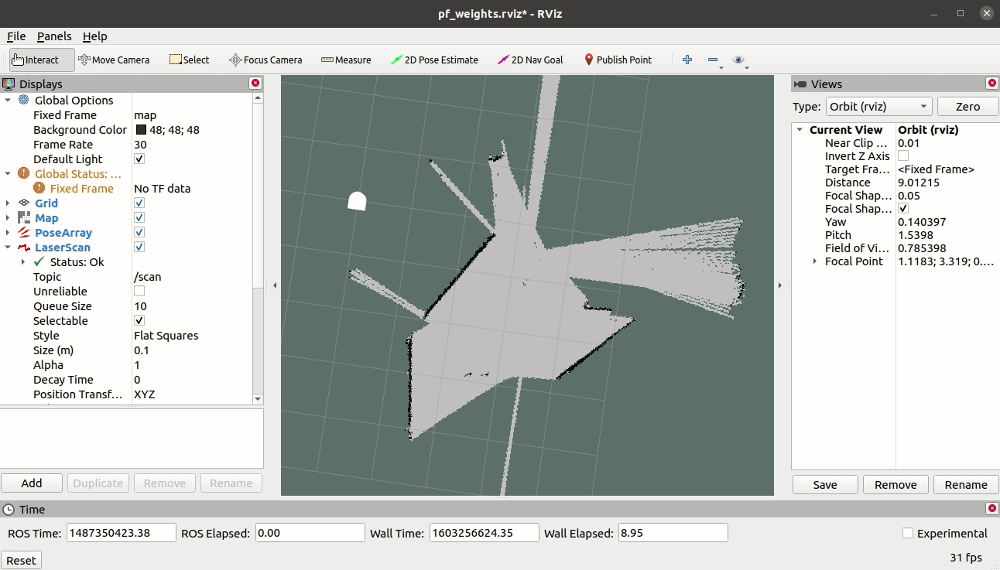
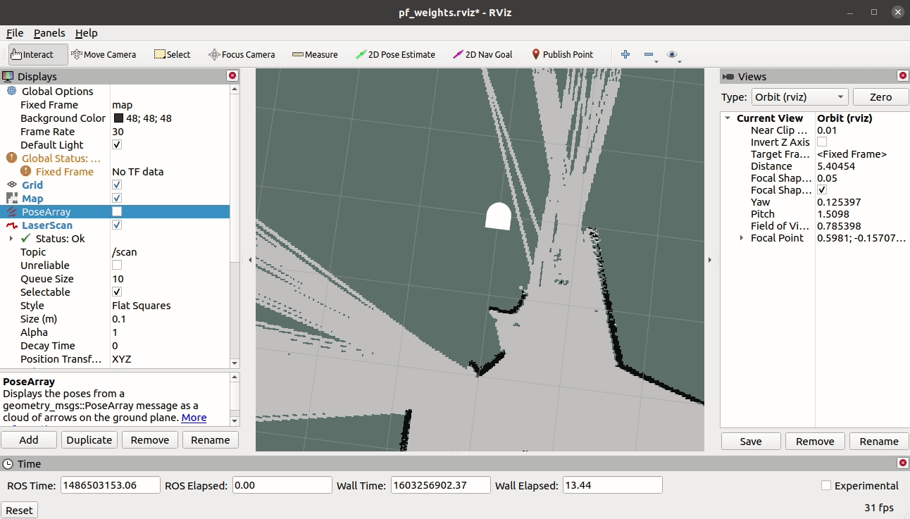
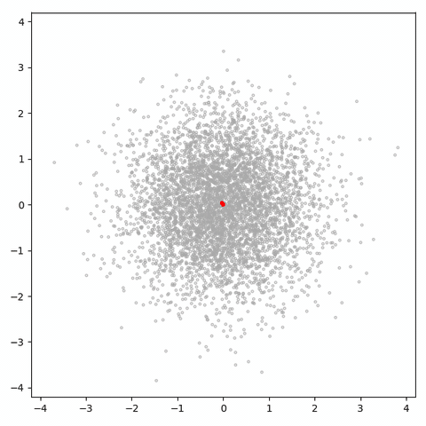
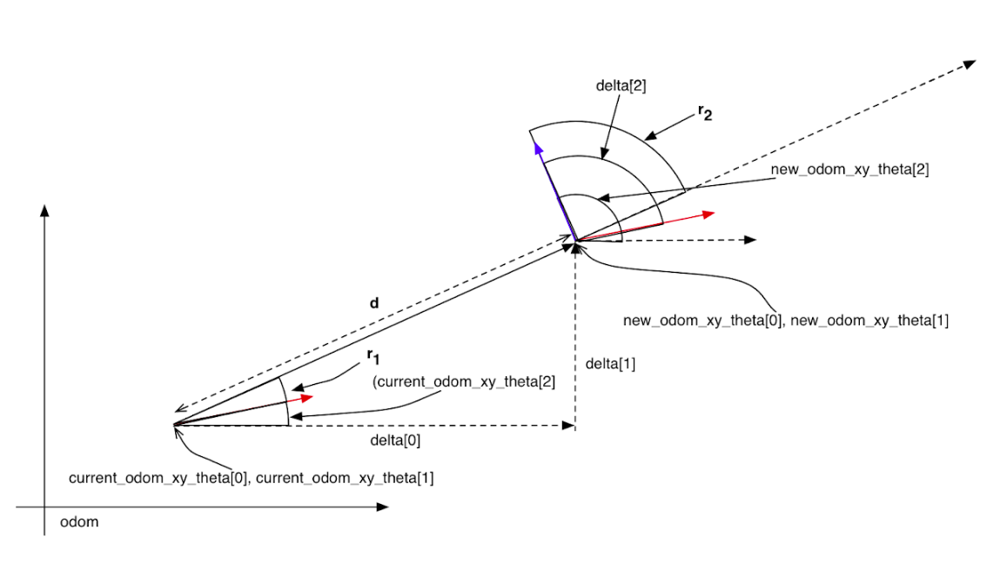
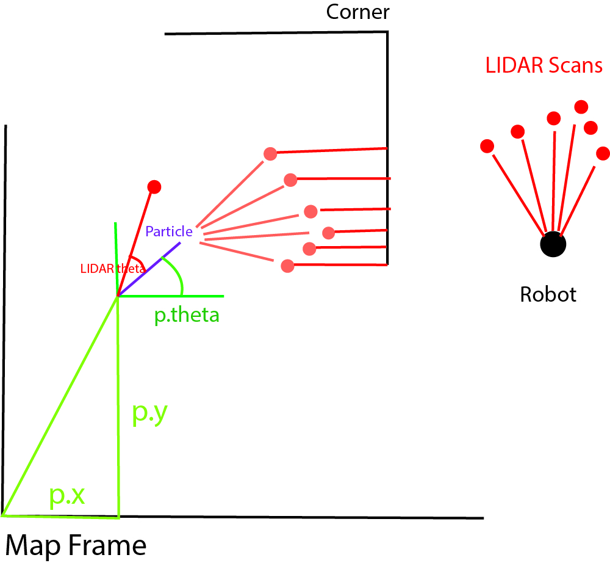
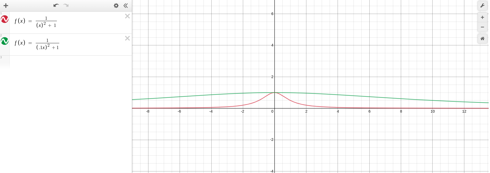

# Robot Localization - Implementing a Particle Filter
Richard Gao & Loren Lyttle

### 1. Project overview
#### 1.1 Description
This project's purpose was to understand, create, and implement the key aspects of a particle filter. Particle filters are increasingly significant in the world today as robots are introduced to non-experimental environments. In this context, we were tasked with getting a Neato robot to locate itself on a given map using primarily wheel encoder and LIDAR measurements. The general plan for the project was to use a bag file, taken with the help of ROS's gmapping feature, and a guess at the robot's initial pose. In running our particle filter, we would slowly refine the estimate of the robot's position until it closely matched the true path it took.
#### 1.2 Project Goals
The basic structure of a particle filter has 5 components. In successfully constructing a particle filter, these 5 key steps are repeated to estimate the Neato's position in the map over the course of the execution:

1. Initialize a span of particles in the map either randomly or over a gaussian distribution.
2. Update the particles with reference to the Neato's movement in Odom.
3. Calculate the weights of each particle based on the resemblance of their surroundings to the Neato's.
4. Resample particles with probability proportional to their weights.
5. Using the particle field, update the estimated pose of the robot.

In addition to the implementation of these steps, we wanted to push the code a little further and visualize the weights of each particle in rviz. Not only would it provide a nice visual representation of how the particle filter works, but it would prove a valuable time-saving tool when debugging the code.

### 1.3 Project Results
Using map `ac109_1` our filter runs pretty well given an accurate 2D Pose Estimate.

Our particle filter also fairs pretty well in map `ac109_2`.

Map `ac109_3` was a bit more challenging with its smaller area and sharp turns. However, the particle filter works decently here, only drifting off slightly more than normal.

Map `ac109_4` proved to be the worst as the estimation lagged behind the ground truth and was ultimately slightly shifted left.

To help debug the particles, we better visualized the particle weights using arrows who's opacity mirrored the particle's weight value.

### 2. Code Structure
#### 2.1 Initialize Particles
In this step particles are placed onto the map in semi-random orientations. We chose to initialize the particles around the robot with their positions selected from a gaussian distribution. This ensured that each time the particle field was initialized, they would stay around the robot while still being able to adapt to most translations. We chose the value of 0.3 for the standard deviation of the distribution; reasonably small because we were confident that our initial estimate of the robot pose was accurate. A gaussian distribution was also drawn from to define the theta value of each particle. This time, the standard deviation was even smaller at 0.1. Because we manually set the initial estimate, we were confident that its orientation would be very similar to that of the true pose. All particles started with identical weights of 1. These parameters were simple to conceptualize, and worked reasonably well throughout the project.

Another possible course for this step was to evenly distribute particles across the entire map. This would be beneficial if the initial pose estimate was very uncertain because most of the map can be tested. In the previously mentioned model, it was a requirement that the initial pose was close to the true pose.
#### 2.2 Update Particles with Odom
To update the particles with odom, we first believed that simply adding `delta[0]` and `delta[1]` to each particle's location would be sufficient. However, this does not account for the difference between the odom and map frames. Instead we changed our strategy to move each particle like it was the robot, taking place in three steps.

##### 2.2.1 Align Particle with Direction of Travel
To rotate the particles so that they pointed in the direction of translation, we needed to find the difference between the angle of the robot model, and the angle the robot moved in. The former is given as a variable in the code (self.current_odom_xy_theta) and the latter was simply the arctangent of `delta[1]/delta[0]`. These two angles were then used to create two unit vectors, whose dot product helped us derive the desired angle (`r_1`). Now, as an angle free of attachment to the odom frame, it was simply added to the theta value of each particle. Additionally, noise was added to `r_1` to represent wheel slipping when turning.
##### 2.2.2 Translate Particle to New x, y Position
To translate the particles, we created a vector composed of distance and direction. The distance can be found by finding the hypotenuse of a right triangle with side lengths `delta[0]` and `delta[1]`. Since we already pointed each particle in the direction of travel, particle.theta gave us the direction. The x and y translations were then solved for with the following relationship:
x_translation = magnitude * cos(direction)
y_translation = magnitude * sin(direction)
These translation values were now in the map frame, and could be added to `particle.x` and `particle.y` respectively. This approach was ideal because we did not have to add noise to both the x and y translations, but just to the magnitude. This is analogous to how a real robot moves.
##### 2.2.3 Rotate Particle to final Orientation
Finally, now at the correct position, each particle required one last rotation to match the robot (`r_2`). This value is equal to the amount that a particle was turned in step one (`r_1`) subtracted from the total rotation of the robot (`delta[2]`).
#### 2.3 Weigh Particles
This step in the code is for weighing each particle based on its likelihood of being in the true pose position. After this step, each particle should have a value that represents the probability that it will be kept for the next step, resampling. To begin, the LIDAR message was used to create an array of points in front of the robot, each symbolizing an object in the robot's view. They were defined by an angle (the LIDAR message index) and a distance (the lidar message). Doing this kept the points in the base frame, meaning they could be easily transformed onto each particle. For each particle, the 'ghost' readings were redefined in the map frame using the particle's position. We then utilized the occupancy field function to find the closest object to each ghost point. Theoretically, a particle in the exact pose position would receive a distance of 0 for each ghost point, as they would be on top of the actual map obstacle.

To condense these readings into one probability, we had three next steps. First was to transform each distance reading into a decimal. This would allow us to combine them into one probability for the next step. We created an equation relating distance to a scale from 0 to 1. While similar to a normal distribution, it fit our specific criteria; to be easily modified, no value greater than one, and to decrease probability with greater distances:

% = 1/((0.1x^2)+1)

Where x = distance to closest object for each ghost point.

Step two was to multiply these individual lidar scan probabilties together. This combines all the probabilties at each individual lidar point for a given particle. We do this making the assumption that each of the lidar measurements is conditionally independent given the robot’s state. At this stage, each particle has a number representing its ‘probability’ but only in reference to the other particles. To turn that into a real probability that we can operate on, we used a normalize function; this is step three. The normalize function divides each probability by the sum of probabilities for all particles. This means all of the probabilities will now sum to one, and can be used for particle resampling.
#### 2.4 Resample Particles
After updating the particles with their weights, we resample with replacement the particles such that we have a new set of particles distributed around particles with higher weights. The weights of each particle therefore describe the probability that the particle is a good estimation of the robot's position. To resample, we randomly choose particles from the existing set of particles with those with larger weights have a greater probability of being chosen.
#### 2.5 Update Robot Pose
The robot's estimated pose is updated using the average of all the particles' positions and orientations.

### 3. Looking Back
#### 3.1 Compromises
Once the basic concepts of the particle filter were functional, we looked towards optimizing the accuracy of the pose estimate. As stated in section 2.3, the particles were weighted using the algebraic equation: 1/((0.1x^2)+1). In this model, .1 represents the steepness of the curve as it goes towards its maximum (large values resulting in a pointy peak, small numbers resulting in a broad peak). Changing this value affected the distribution of particle weights. We noticed that, when this value was around one, the particles were converging on the robot almost immediately, but would not align with the true pose. On the other end of the spectrum, spreading the particles too wide meant that they would not be able to agree on a single location for the pose. With this information, we decided to lean towards a broader particle spread, as an estimate that doesn't converge (formed from the average of a spread of particles) was favorable to an incorrect one.

(The green curve above is the function we ended up using. The red curve is more steep as x approaches 0, allowing for particles to more easily converge.)

#### 3.2 Challenges
A recurring obstacle during this project was moving between different reference frames. While a few helper functions were given in the scaffolded version of this code, it was difficult to determine when and where a transformation had to be made. This issue led to a slightly larger problem when we misinterpreted the strategy to weight each particle. Rather than translating lidar scan points, we were directly comparing the closest distance of the robot to that of each particle. This set us back in the project, but also provided an opportunity to work on other steps. By the time it was understood that our weigh particles section required modification, it was relatively easy to test the results in rviz immediately.
#### 3.3 What Went Well
Although this project had challenges, two aspects that went particularly well for us were how we weighted the particles and inserted noise. Both of these factors significantly impacted the accuracy of the robot pose estimate, and both were written clearly and in strategic locations. It was valuable to have parameters whose affect on the robot was well understood, and easily changed. This left us some extra buffer space from imperfections in other parts of the code, such as the particle update with Odom section.

### 4. Looking Forward
#### 4.1 Future Improvements
If given more time on the project, we would first like to further refine the pose estimate. Ideally, the particle filter would be able to guess the pose with a high certainty. We would like to see the particles spread out slightly for each resampling, then tightly converge when updated with the LIDAR. These qualities describe the beginning of a very robust particle filter. After this, it may be interesting to return values from the filter to quantify certainty, accuracy, and other metrics. With such information we would be able to methodically optimize the particle filter with the adjustment of a few variables.
Possibly beyond the scope of our current abilities, it may be worthwhile to combine the particle filter with other robotic concepts, like room mapping. Such programs could allow a robot to 'remember' a room, and locate features out of its view.
#### 4.2 Lessons Learned
- When working with a global frame, like map, transform all other coordinates to that frame first.
- Work in Radians. Degrees may be convenient, but most calculations are smoother in radians.
- Remember linear algebra can be a big help when doing coordinate transformations.
- Reach a decent understanding of a step/concept/function's purpose before trying to make it. Otherwise you may be working backwards.
